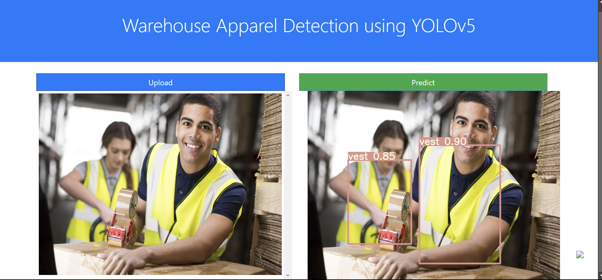

# Warehouse Apparel Detection using YOLOv5

This project implements an apparel detection system for warehouses using the YOLOv5 (You Only Look Once version 5) model. The aim is to accurately identify and locate apparel items in warehouse images, facilitating inventory management and improving operational efficiency.

## Table of Contents

* [Project Overview](#project-overview)
* [Tech Stack](#tech-stack)
* [Project Architecture](#project-architecture)
* [Dataset](#dataset)
* [Results](#results)
* [Challenges](#challenges)
* [Future Scope](#future-scope)
* Result

## Project Overview

This project leverages YOLOv5, a state-of-the-art object detection model, to identify apparel items in images captured in a warehouse setting. By implementing this system, warehouses can automate the process of tracking inventory, reducing manual errors, and enhancing the speed of inventory management.

## Tech Stack

* **Programming Language** : Python
* **Deep Learning Framework** : PyTorch
* **Object Detection Model** : YOLOv5
* **Image Processing Libraries** : OpenCV, PIL
* **Data Visualization** : Matplotlib, Seaborn
* **Environment** : Jupyter Notebook or any Python IDE

## Project Architecture

The architecture of the project consists of the following components:

1. **Data Collection** : Gathering images of apparel from the warehouse.
2. **Data Annotation** : Labeling the collected images using tools like LabelImg to create a dataset for training.
3. **Model Training** : Training the YOLOv5 model on the annotated dataset.
4. **Model Evaluation** : Assessing the model’s performance using various metrics (e.g., mAP, precision, recall).
5. **Inference** : Running the trained model on new images to detect and locate apparel items.

## Dataset

* The dataset comprises images of various apparel items, annotated for training the YOLOv5 model. Images can be sourced from the warehouse or publicly available datasets.
* A `data.yaml` file is included to specify the path to the training and validation datasets and the classes to be detected.

## Results

* The project includes evaluation metrics such as mean Average Precision (mAP) to assess the model’s performance on the test dataset.
* Visualization of detected items will be displayed with bounding boxes around identified apparel.

## Challenges

* Ensuring high-quality annotations for the dataset.
* Achieving a balance between model accuracy and processing speed.
* Adapting the model to varying lighting conditions and perspectives in warehouse images.

## Future Scope

* Enhance the model with transfer learning techniques for improved accuracy.
* Implement real-time detection capabilities with a live camera feed.

## Result

